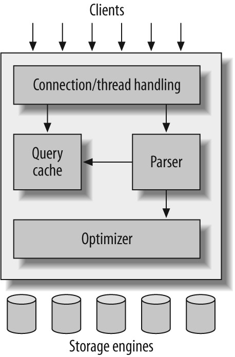

# MySQL
Logical architecture of MySql: 

MySQL parses queries to create an internal structure (the parse tree), and then applies a variety of optimizations. To begin, MySQL’s parser breaks the query into tokens and builds a “parse tree” from them. The parser uses MySQL’s SQL grammar to interpret and validate the query

Optimizers: responsible for determining the most efficient way to execute a SQL statement. It evaluates different query execution plans and chooses the one that it estimates will have the lowest cost, where cost is defined as the amount of resources (e.g. CPU, I/O) required to execute the query (Query performance Optimization)

Storage engine: Storage engines are MySQL components that handle the SQL operations for different table types to store and manage information in a database

### ACID
ACID stands for Atomicity, Consistency, Isolation, and Durability

